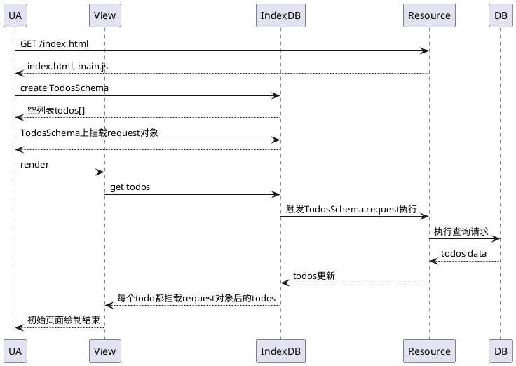
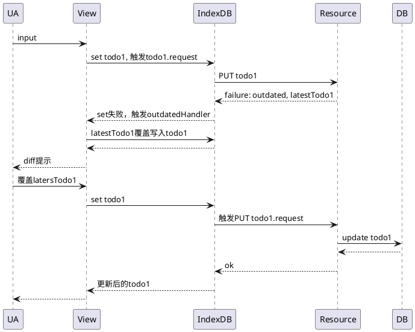
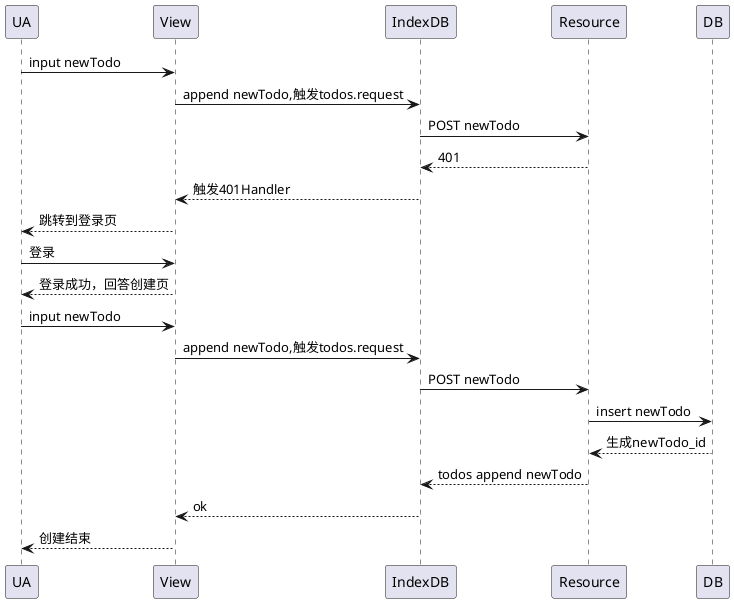
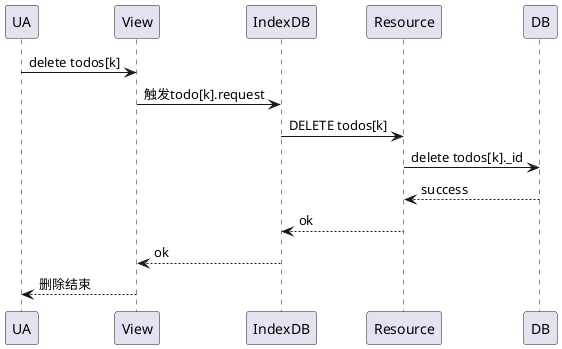

title: Design-事件驱动的CRUD应用
tags:
- Design
---

# 背景
大量CRUD类应用
重复的网络请求与响应

# 思路
后端抽象为资源层（就是REST定义的资源）和DB层
资源层是根据业务对DB进行扁平化后的资源表示及将对资源的CRUD操作映射到DB层上
前端抽象出IndexDB层和View层
IndexDB层数据集是资源层数据集的子集
View层由Web技术和IndexDB层的数据构建
网络请求通过事件机制触发
响应由注册在IndexDB层上的handler处理
handler只需要处理异常情况和view层的DOM更新

# 交互设计
## 案例
Todo应用
## 系统过程
不同的操作最终会映射为HTTP verb，所以每个HTTP verb应该有一个对应的交互过程。CRUD应用中最常用的包括GET，PUT，POST，DELETE，所以R，U，C，D过程是首先应该支持的。
### R过程

R过程其实包含两部分，首先是下载WebApp代码及初始化过程，初始化时会执行WebApp的js代码，创建App启动需要的最少的IndexDB schema，并在其中挂载handler。初始化完成后，才是真正的R过程，R过程一般以一个集合资源实例为起点，发起GET请求。当然也可以以单个资源实例为起点。因为我们使用的Todos应用作为案例，所以从todos集合资源实例为起点发起R过程。R过程结束后我们

### U过程

### C过程

### D过程

