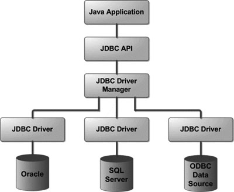

title: 一探究竟-JDBC
tags: Java, JDBC
---

# 引入目的
- 标准的数据库访问API
- 数据库无关的(数据库可移植)

# 两层架构

支持包:
- `java.sql`: 基础JDBC库
- `javax.sql`: 引入DataSource和连接池

# 核心组件
JDBC API接口:
- `Connection`
- `Statement`
- `PreparedStatement`
- `CallableStatement`
- `ResultSet`

JDBC Driver Manager:
- `DriverManager`

JDBC Driver:
- `Driver`

# 基本使用流程
- 注册驱动: `Class.forName("xxx.xxx.Driver")`
- 打开连接: `DriverManager.getConnectioin(DB_URL,USER,PASSWORD)`
- 创建查询
- 执行查询
- 从ResultSet提取数据
- 关闭连接

## 注册驱动
通过`Class.forName("xxx.xxx.Driver")`来加载数据库vendor的Driver实现类.
数据库vendor实现的Driver会在被ClassLoader加载时实例化自己,并调用`DriverManager.registerDriver()`将实例添加到DriverManager中的一个列表中,完成注册.

## 打开连接
`DriverManager.getConnectioin(DB_URL,USER,PASSWORD)`,`DriverManager`会遍历自己持有的Driver列表,在每一个Driver上尝试调用`connect()`.如果成功获得连接,则返回该连接.  
