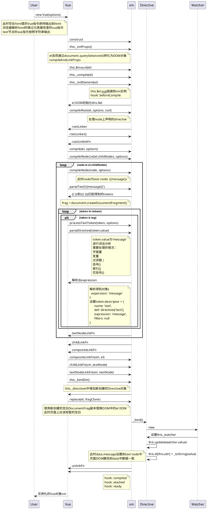

title: 知其所以然-Binding_System_of_Vue
date: 2016-09-19 22:42:00
tags:
- Vue
- Javascript
- Web
---


# 目标
- [ ] 理解Vue的binding系统工作原理
- [ ] 理解单向绑定和双向绑定实现方法
- [ ] 实现一个简单的单向绑定的Demo

# 引入
## DOM更新

浏览器构建DOM Tree，渲染视图，并提供DOM API更新视图。浏览器保证视图的渲染结果和DOM Tree中的数据同步。开发者经常会从服务器加载数据更新到视图上，或根据用户的交互改变视图。这些改变视图的方式可以抽象成改变视图状态数据（即数据驱动视图）。

我们一般都会使用data object保存从服务器加载到的数据或记录用户交互的状态数据，然后把这些data object里的数据同步到DOM对象的各个属性值上，触发视图的更新。

一般的做法是这样的：

```
<div>
  Hello,<span id="name"></span>
</div>

<script>
  var name = 'f-12';
  $('#name').text(name);
</script>
```
name代表data object（既可能是从服务器上加载的数据，也可能是用户交互产生的状态数据），当我们把值赋给DOM的属性（使用原生DOM API或jQuery)，修改视图后，data，object就和DOM的属性值没有关系了，假如我们再次更新name，DOM属性值并不会变化，因而视图也不会变化。我们必须再次修改DOM属性才可以更新视图，即每次状态数据发生变动时我们必须手动更新视图。

手动更新DOM显得很繁琐。前端工程更加复杂，用户交互更加复杂，单页应用更加流行，产生了更多的状态数据，这些因素也凸显了手动更新DOM的缺点。

## Binding
Binding的思想就是建立data object和DOM对象之前的关系，使得我们修改data object上的属性值时自动完成DOM对象的更新。

# 观察者模式
- 原理
- javascript实现的观察者模式Demo

# Vue的binding系统
## Overview

（图片来自vuejs.org)

Web开发中比较频繁出现的场景是：
- 有很多状态数据需要同步到DOM上（DOM操作，这也是jQuery流行的主要因素）
- 多个DOM对象用到同一个状态数据，状态发生变动时需要更新所有DOM

## 最简单的🌰
```html
<div id="app">
  {{ message }}
</div>
```
```javascript
import Vue from 'vue';
const vm = new Vue({
  el: '#app',
  data: {
    message: 'Hello Vue.js!'
  }
})
```
—— Reference [vuejs.org](http://vuejs.org/guide/)

这个代码段的效果是页面渲染时，message的值会自动同步到DOM中，当修改message时，DOM会同步更新。
接下来，我们来探究一下这一切是怎么发生的。

## import
`new Vue()`之前，我们首先得引入Vue的库，我们使用ES6的`import`方式。
`import Vue from 'vue'`执行时，会首先找到`vue`包，然后执行里面的`index.js`代码，将其中导出的对象绑定到`Vue`这个标识符上。
在这一步，定义Vue类，导出一个构造函数来实例化（Vue实例化时做了很多事情，我们稍后再深入）。

## 实例化过程
### el选项

### data选项
  <!-- end
  end
  end
  note left of vm
  checkTerminalDirectives
  checkElementDirectives
  checkComponent
  compileDirectives
  存在则返回linkFn
  不存在返回null -->
### `{{message}}`
